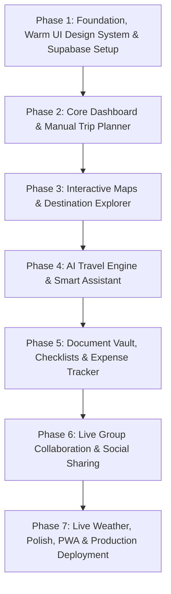
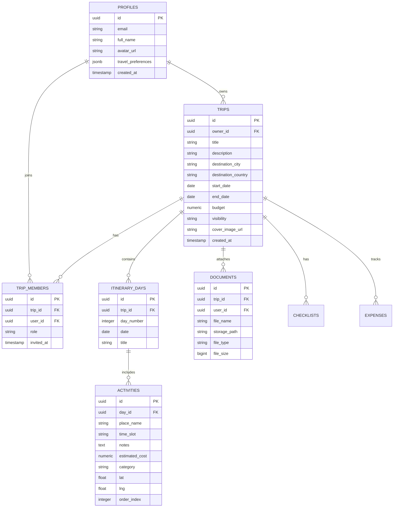

# 🗺️ Smart Travel Planner & Discovery App — Phase-Wise Master Plan

An all-in-one, AI-powered travel planning platform built with **React 18 + TypeScript + Tailwind CSS** on the frontend, and **Supabase (Auth + PostgreSQL + RLS + Storage + Realtime)** on the backend.

---

## 🛠️ Tech Stack & Architecture

| Layer | Technology | Details & Purpose |
|---|---|---|
| **Frontend Framework** | React 18+ (Vite) + TypeScript | Type-safe, ultra-fast modular client application |
| **Styling & UI System** | Tailwind CSS + Custom Design Tokens | Soft, warm, gentle travel UI with light/dark theme support |
| **Icons & Micro-interactions** | Lucide React | Lightweight, consistent iconography |
| **Routing** | React Router v6 | Nested layouts, public auth & protected route guards |
| **Server State & Cache** | TanStack Query (React Query) | Declarative queries, mutations, cache invalidation & optimistic updates |
| **Backend & Database** | Supabase (PostgreSQL) | Relational database with automated foreign keys and RLS policies |
| **Authentication** | Supabase Auth | Email/password, OAuth providers, and session persistence |
| **Storage (Vault)** | Supabase Storage | Secure buckets for ticket PDFs, booking vouchers, and trip media |
| **Realtime Sync** | Supabase Realtime Channels | Live collaborative itinerary updates across devices |
| **AI Integration** | Google Gemini API / OpenAI API | Itinerary generator, smart suggestions, and travel companion chatbot |
| **Maps & Geo Services** | Leaflet.js (`react-leaflet`) / Mapbox GL | Interactive destination maps, daily activity markers, route lines |
| **External APIs** | OpenWeatherMap API, GeoDB Cities API | Live weather forecasts and global city metadata |

---

## 🧭 High-Level Execution Flow

---

## 🗄️ Supabase Relational Database Schema

---

## 📌 Phase-by-Phase Roadmap

### ✅ Phase 1: Foundation, UI System & Supabase Setup *(Completed)*
- Project scaffolding with Vite, React 18, and TypeScript.
- Tailwind CSS setup with custom design tokens for light & dark themes.
- Supabase client configuration, AuthContext, protected routing, and user session management.
- PostgreSQL schema setup with Row-Level Security (RLS) in `supabase/schema.sql`.

### ✅ Phase 2: Core Dashboard & Manual Trip Planner *(Completed)*
- User dashboard with dynamic travel statistics (total trips, countries targeted, travel days, cumulative budget).
- Interactive trip creation modal with duration calculations, presets, and budget goals.
- Multi-day itinerary planner with dynamic day tabs, schedule timelines, and full CRUD operations for activities.
- TanStack Query hooks and `tripService` for Supabase database sync.

### ✅ Phase 3: Interactive Maps & Destination Explorer *(Completed)*
- Interactive Leaflet / Mapbox map synchronized with the itinerary.
- Map markers for daily activities (Sightseeing, Dining, Lodging, Transit).
- Route visualizer connecting daily destinations.
- Global destination discovery page (`/explore`) with filters and "Add to Trip" actions.

### ✅ Phase 4: AI Travel Engine & Smart Recommendations *(Completed)*
- AI-Powered Itinerary Generator (`/ai-planner`): One-click itinerary creation from duration, interests, pace, and budget tier, with a save-as-trip flow via Gemini structured output.
- Context-Aware Travel Companion Chatbot: Per-trip chat with quick prompt chips for food, budget, packing, and rainy-day suggestions.
- GPT Trip Summarizer: "Your trip in 2 minutes" — highlights, local customs, and packing tips.
- `aiService` wraps the Gemini REST API (`gemini-flash-latest`) with graceful offline fallbacks when `VITE_GEMINI_API_KEY` isn't configured.

### 📌 Phase 5: Document Vault, Checklists & Expense Tracker *(Completed)*
- Booking & Ticket Vault: Upload, preview/download, and delete flight/hotel/insurance files via Supabase Storage (private `trip-documents` bucket), with an offline demo-mode fallback that keeps small files inline as base64.
- Smart Packing Checklists: Categorized checklist items (Essentials, Documents, Electronics, Clothing, Toiletries, Other) with progress tracking and an "AI Suggest Packing List" action powered by `aiService`.
- Expense Tracker: Per-trip expense log with category breakdown and a Spent vs. Allocated budget meter, using the existing multi-currency `CurrencyContext` for display/conversion.
- New `documents`, `checklists`, and `expenses` Supabase tables + RLS policies in `supabase/schema.sql`, and `documentService` / `checklistService` / `expenseService` with the same local-storage demo fallback pattern as `tripService`.
- Trip Details page (`/trips/:id`) now has Itinerary / Documents / Checklist / Budget section tabs.

### 📌 Phase 6: Group Collaboration & Social Sharing *(Completed)*
- Realtime Collaboration: `useTripCollaboration` hook subscribes to Supabase Realtime `postgres_changes` on `itinerary_days`, `activities`, and `trip_members` to live-refresh the itinerary for everyone viewing a trip, plus a lightweight "recent activity" banner.
- Presence: Supabase Realtime Presence tracks who else is currently viewing a trip, shown as an avatar stack in the Trip Details action bar.
- Collaborators & Roles: New "Collaborators" panel (`CollaboratorsModal`) to invite existing users by email with `Editor`/`Viewer` roles, change roles, remove collaborators, or leave a trip — backed by `tripMemberService` and new `trip_members` RLS policies.
- Community Feed (`/community`): Browse publicly shared trips and "Clone to My Trips" (duplicates the trip, days, and activities) via `tripService.getPublicTrips()` / `cloneTrip()`.
- Export & Print: "Export .ics" downloads a calendar file of the full itinerary (`calendarExport.ts`), and "Print / PDF" opens a print-friendly full-itinerary view (browser print → Save as PDF).
- `supabase/schema.sql` adds `trip_members` RLS policies and enables the `supabase_realtime` publication for `itinerary_days`, `activities`, and `trip_members`.

### 📌 Phase 7: Live Weather, Polish, PWA & Deployment *(In Progress)*
- ✅ Weather Widget: `weatherService` calls OpenWeatherMap's free 5-day/3-hour forecast API (aggregated into daily min/max + condition) with an offline sample-data fallback when `VITE_OPENWEATHER_API_KEY` isn't configured. Rendered via a reusable `WeatherWidget` on the Trip Details page (by destination city/country) and the Explore destination-insights panel (by exact coordinates).
- Offline PWA caching for travel on the go without cellular data.
- Production build optimization and deployment to Vercel / Netlify.
