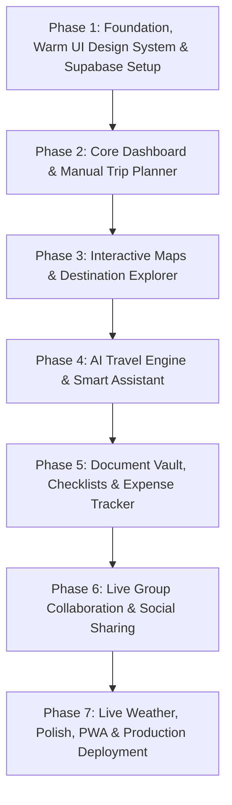
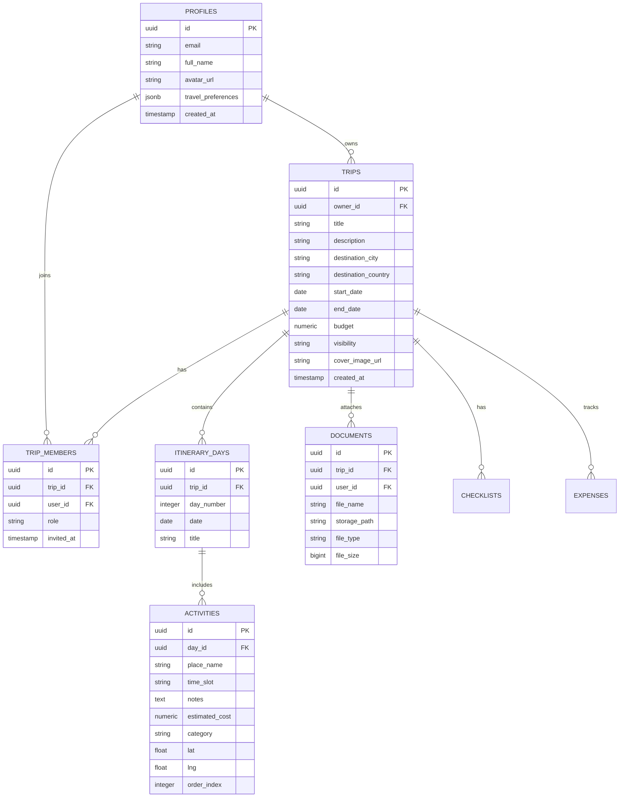

# 🗺️ Smart Travel Planner & Discovery App — Phase-Wise Master Plan

An all-in-one, AI-powered travel planning platform built with **React 18 + TypeScript + Tailwind CSS** on the frontend, and **Supabase (Auth + PostgreSQL + RLS + Storage + Realtime)** on the backend.

---

## 🛠️ Tech Stack & Architecture

| Layer | Technology | Details & Purpose |
|---|---|---|
| **Frontend Framework** | React 18+ (Vite) + TypeScript | Type-safe, ultra-fast modular client application |
| **Styling & UI System** | Tailwind CSS + Custom Design Tokens | Soft, warm, gentle travel UI with light/dark theme support |
| **Icons & Micro-interactions** | Lucide React | Lightweight, consistent iconography |
| **Routing** | React Router v6 | Nested layouts, public auth & protected route guards |
| **Server State & Cache** | TanStack Query (React Query) | Declarative queries, mutations, cache invalidation & optimistic updates |
| **Backend & Database** | Supabase (PostgreSQL) | Relational database with automated foreign keys and RLS policies |
| **Authentication** | Supabase Auth | Email/password, OAuth providers, and session persistence |
| **Storage (Vault)** | Supabase Storage | Secure buckets for ticket PDFs, booking vouchers, and trip media |
| **Realtime Sync** | Supabase Realtime Channels | Live collaborative itinerary updates across devices |
| **AI Integration** | Google Gemini API / OpenAI API | Itinerary generator, smart suggestions, and travel companion chatbot |
| **Maps & Geo Services** | Leaflet.js (`react-leaflet`) / Mapbox GL | Interactive destination maps, daily activity markers, route lines |
| **External APIs** | OpenWeatherMap API, GeoDB Cities API | Live weather forecasts and global city metadata |

---

## 🧭 High-Level Execution Flow

---

## 🗄️ Supabase Relational Database Schema

---

## 📌 Phase-by-Phase Roadmap

### ✅ Phase 1: Foundation, UI System & Supabase Setup *(Completed)*
- Project scaffolding with Vite, React 18, and TypeScript.
- Tailwind CSS setup with custom design tokens for light & dark themes.
- Supabase client configuration, AuthContext, protected routing, and user session management.
- PostgreSQL schema setup with Row-Level Security (RLS) in `supabase/schema.sql`.

### ✅ Phase 2: Core Dashboard & Manual Trip Planner *(Completed)*
- User dashboard with dynamic travel statistics (total trips, countries targeted, travel days, cumulative budget).
- Interactive trip creation modal with duration calculations, presets, and budget goals.
- Multi-day itinerary planner with dynamic day tabs, schedule timelines, and full CRUD operations for activities.
- TanStack Query hooks and `tripService` for Supabase database sync.

### 📌 Phase 3: Interactive Maps & Destination Explorer *(Next)*
- Interactive Leaflet / Mapbox map synchronized with the itinerary.
- Map markers for daily activities (Sightseeing, Dining, Lodging, Transit).
- Route visualizer connecting daily destinations.
- Global destination discovery page (`/explore`) with filters and "Add to Trip" actions.

### 📌 Phase 4: AI Travel Engine & Smart Recommendations
- AI-Powered Itinerary Generator: One-click creation based on duration, interests, pace, and budget tier.
- Context-Aware Travel Companion Chatbot: Suggests offbeat spots, local dining, and rainy-day alternatives.
- GPT Trip Summarizer: "Your trip in 2 minutes".

### 📌 Phase 5: Document Vault, Checklists & Expense Tracker
- Booking & Ticket Vault: Upload and preview flight/hotel PDFs via Supabase Storage.
- Smart Packing Checklists: Categorized packing lists with AI climate/activity suggestions.
- Expense Tracker & Currency Converter: Live budget meter and conversion rates.

### 📌 Phase 6: Group Collaboration & Social Sharing
- Real-time multi-user co-planning using Supabase Realtime channels.
- Invites and permission roles (`Owner`, `Editor`, `Viewer`).
- Public community feed (`/community`) with trip cloning.
- Export itinerary as printable PDF or downloadable `.ics` calendar file.

### 📌 Phase 7: Live Weather, Polish, PWA & Deployment
- OpenWeatherMap integration for 7-day weather forecasts.
- Offline PWA caching for travel on the go without cellular data.
- Production build optimization and deployment to Vercel / Netlify.
