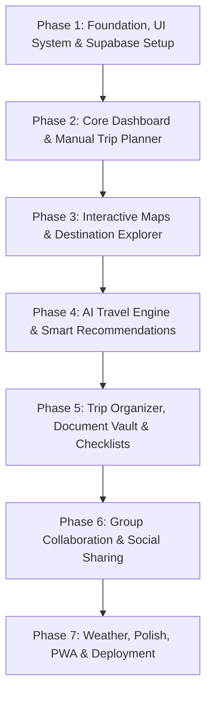
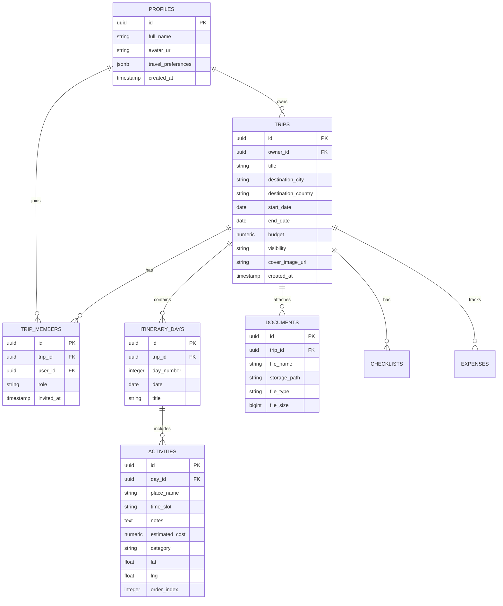

# 🗺️ Smart Travel Planner & Discovery App — Project Roadmap & Phase-Wise Plan

An all-in-one travel dashboard powered by React and AI to help users get inspired, plan smarter, and travel better.

---

## 🛠️ Tech Stack & Architecture

| Layer | Technology | Details / Purpose |
|---|---|---|
| **Framework** | React 18+ (Vite) + TypeScript | Modern, type-safe frontend |
| **Styling & UI** | Tailwind CSS + Shadcn UI + Lucide Icons | Accessible, responsive design system |
| **Routing** | React Router v6 | Client-side routing with protected routes |
| **State Management** | TanStack Query + Zustand / Redux Toolkit | Global state & server cache synchronization |
| **Backend & Database** | Supabase (PostgreSQL + RLS + Realtime) | Relational database, Row Level Security, and live sync |
| **Authentication** | Supabase Auth | Email/Password, Google OAuth, session handling |
| **File & Media Storage** | Supabase Storage | Document vault (PDFs, tickets) & user uploads |
| **Maps & Geolocation** | Leaflet.js (`react-leaflet`) / Mapbox GL | Interactive maps, landmark markers & route lines |
| **AI Integration** | Google Gemini API / OpenAI API | Itinerary generation, smart suggestions & chatbot |
| **Weather & External APIs** | OpenWeatherMap API, GeoDB Cities API | Live weather forecasts & destination data |

---

## 🧭 High-Level Execution Flow

---

## 🗄️ Supabase Backend Architecture & Database Schema

---

## 📌 Phase 1: Foundation, UI System & Supabase Setup
**Goal:** Scaffold a scalable project, configure design tokens, initialize Supabase, and establish secure user authentication with Row Level Security (RLS).

### Deliverables & Tasks
1. **Scaffolding & Tooling**
   - Initialize Vite project with React + TypeScript.
   - Configure Tailwind CSS, PostCSS, path aliases (`@/*`), ESLint, and Prettier.
   - Install core Shadcn UI components (Button, Input, Dialog, Dropdown, Card, Toast, Avatar, Badge).
2. **App Shell & Layout**
   - Responsive Navbar with Theme Toggle (Light/Dark mode) and user profile dropdown.
   - Sidebar navigation for Dashboard, Explore, My Trips, Saved Places, and Settings.
3. **Supabase Client & Authentication**
   - Setup `@supabase/supabase-js` client with environment variables (`VITE_SUPABASE_URL`, `VITE_SUPABASE_ANON_KEY`).
   - Implement Supabase Auth (Email/Password, Google OAuth, session listeners).
   - Auth pages: Login, Sign Up, Forgot Password, and Protected Route wrappers.
   - User profile sync via PostgreSQL triggers (`public.profiles` auto-created on `auth.users` insert).
4. **Supabase Database & RLS Schema Setup**
   - Design PostgreSQL relational schema: `profiles`, `trips`, `trip_members`, `itinerary_days`, `activities`, `documents`.
   - Configure Row Level Security (RLS) policies for user data privacy and collaborative trip access.

---

## 📌 Phase 2: Core Dashboard & Manual Trip Planner
**Goal:** Allow users to create, view, and manually manage trips with multi-day itineraries backed by Supabase.

### Deliverables & Tasks
1. **User Dashboard (`/dashboard`)**
   - Overview of active, upcoming, and past trips fetched from Supabase.
   - Quick stats widget: Total countries visited, total days traveled, upcoming departures.
2. **Trip Creation Flow**
   - Multi-step modal/form: Title, destination city/country, date range picker, cover image picker, budget estimate, travel style (Solo, Couple, Family, Friends).
   - Insert trip records into `trips` and auto-generate `itinerary_days` rows in Supabase.
3. **Trip Details & Day-by-Day Itinerary View (`/trips/:id`)**
   - Dynamic day tabs (Day 1, Day 2, etc.) linked to `itinerary_days`.
   - Time-slotted schedule layout: Morning, Afternoon, Evening cards.
   - CRUD operations for activities: Add place/attraction, time slot, notes, estimated cost, category tag.
4. **State Management & Persistence**
   - TanStack Query hooks with Supabase SDK for fetching, caching, and optimistic mutations.

---

## 📌 Phase 3: Interactive Maps & Destination Explorer
**Goal:** Provide an interactive map and search discovery tool to find landmarks and add them directly to trips.

### Deliverables & Tasks
1. **Destination Discovery Page (`/explore`)**
   - Debounced search bar (Country, City, Landmark).
   - Destination cards with images, top highlights, safety rating, and best travel seasons.
   - Filter by continent, budget level, and travel vibes (Beach, Adventure, Culture, Nightlife).
2. **Interactive Map Component**
   - Leaflet / Mapbox map synchronized with current trip or explore view.
   - Custom map markers for lodging, dining, sightseeing, and transit.
   - Interactive marker popup with direct "Add to Itinerary" action.
3. **Route Visualizer**
   - Connect daily itinerary pins with route lines to preview the travel sequence.

---

## 📌 Phase 4: AI Travel Engine & Smart Recommendations
**Goal:** Leverage LLMs (OpenAI / Gemini) to auto-generate personalized itineraries and offer a 24/7 travel assistant.

### Deliverables & Tasks
1. **AI Itinerary Generator ("One-Click Plan")**
   - Input modal: Destination, duration (days), budget tier ($/$$/$$$), pace (Relaxed vs. Packed), interests (History, Foodie, Nature, Nightlife).
   - Structured JSON schema prompt engineering to automatically populate days, activities, and time slots into state.
2. **AI Travel Assistant / Chatbot ("Travel Companion")**
   - Floating context-aware chat drawer on trip pages (aware of current trip destination & dates).
   - Quick prompt chips: *"Find top vegetarian spots near Day 2"*, *"Suggest rainy-day indoor activities"*, *"Estimate daily budget breakdown"*.
3. **GPT Trip Summarizer**
   - "Your trip in 2 minutes": auto-generate highlights, local customs/etiquette tips, and packing suggestions.

---

## 📌 Phase 5: Trip Organizer, Document Vault & Checklists
**Goal:** Centralize travel logistics, documents, tickets, and checklists in one place backed by Supabase Storage.

### Deliverables & Tasks
1. **Document & Booking Vault**
   - Secure file upload for flight tickets, hotel vouchers, and travel insurance (PDF/Image) using Supabase Storage buckets with user-restricted access policies.
   - In-app document previewer and download trigger.
2. **Smart Packing & Pre-Trip Checklists**
   - Pre-categorized checklists: Essentials, Documents, Electronics, Clothing, Toiletries stored in Supabase `checklists` table.
   - AI auto-suggest checklist items tailored to destination climate and activities.
3. **Expense Tracker & Currency Converter**
   - Log expenses per activity with category breakdown in `expenses` table.
   - Budget meter (Spent vs. Allocated Budget) and live currency conversion rates.

---

## 📌 Phase 6: Group Collaboration & Social Sharing
**Goal:** Enable real-time co-planning, invitations, and public itinerary sharing using Supabase Realtime.

### Deliverables & Tasks
1. **Realtime Collaboration Engine**
   - Supabase Realtime channel subscriptions on `activities` and `itinerary_days` for live sync across active users.
   - Invite collaborators via email or shareable link with permission roles (`Editor`, `Viewer`) tracked in `trip_members`.
   - Collaborator avatars, presence indicators, and activity logs.
2. **Public Itineraries & Community Feed (`/community`)**
   - Trip privacy toggles: `Private`, `Shared`, or `Public` guarded by PostgreSQL RLS.
   - Public trip showcase with "Clone to My Trips" for community inspiration.
3. **Export & Print**
   - Export trip itinerary as a formatted PDF or `.ics` calendar file.

---

## 📌 Phase 7: Weather, Polish, PWA & Deployment
**Goal:** Add final polish, performance optimizations, and deploy to production.

### Deliverables & Tasks
1. **Weather Widget**
   - Integrate OpenWeatherMap API for 7-day weather forecasts on destination and itinerary pages.
2. **Performance & Offline Support**
   - Image optimization (lazy loading, modern formats).
   - Service Worker / PWA setup for offline itinerary viewing.
3. **Testing & QA**
   - Unit tests for date math, budget calculations, and currency conversion.
   - End-to-end user flows (trip creation to AI generation).
4. **CI/CD & Deployment**
   - Deploy frontend to Vercel / Netlify with automated GitHub actions.
   - Configure environment variables, custom domain, and SSL.
